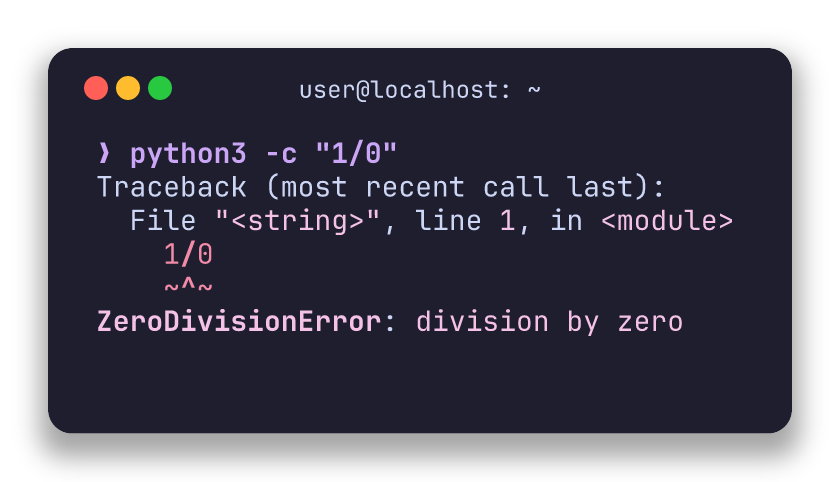
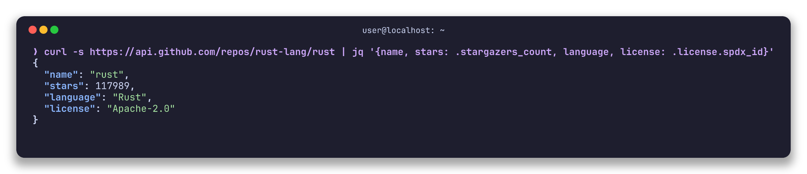
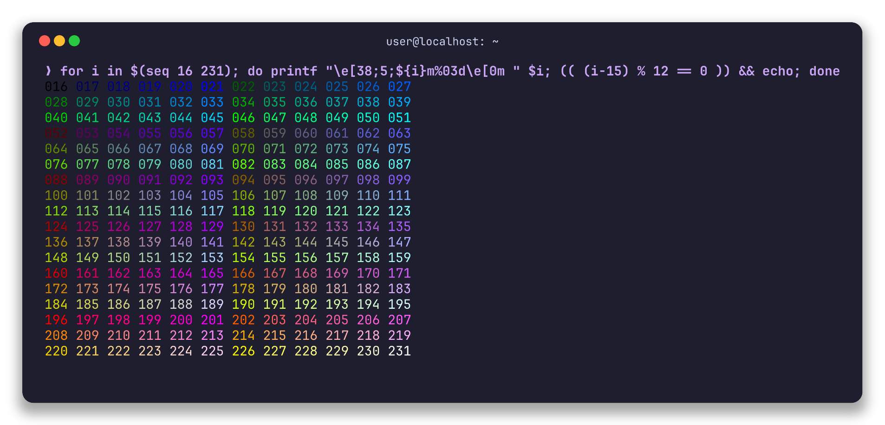
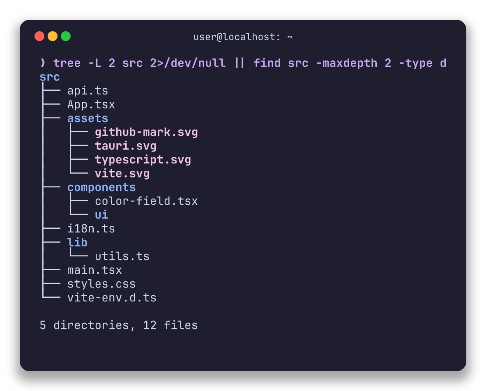
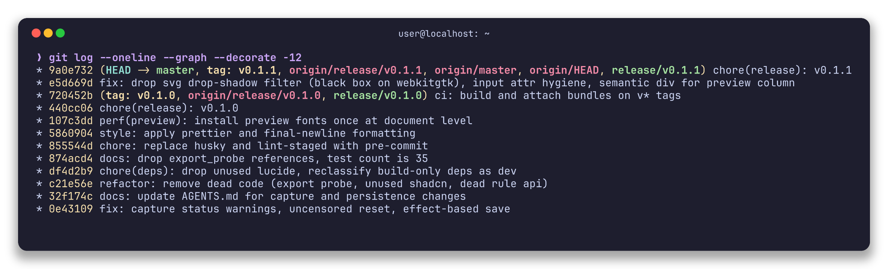

# termcard

Type a shell command, run it in a PTY inside the app, and export the terminal screen as a macOS-style card (PNG 2×/3×/4× or SVG). Sensitive strings (home path, username, hostname) are redacted at render time with editable regex rules. Similar to [termshot](https://github.com/homeport/termshot), but with a GUI.

## Screenshots

ANSI 256-color palette dump:



Git history with decorations:



Real API request through `jq`:



Project tree:



Error capture (Python traceback):



## How it works

- The command runs under `$SHELL -c` in a pseudo-terminal (`portable-pty`), with `TERM=xterm-256color` and `COLORTERM=truecolor`, so colors and emoji render as they would in a real terminal.
- The final screen is parsed (`vt100`) into a small IR: lines of styled text runs (foreground, background, bold, italic, underline).
- The live preview **is** the exported SVG: one renderer, zero divergence. The PNG export rasterizes that same SVG with `resvg`.
- Redaction runs at render time, not capture time, so editing a rule instantly updates the preview without re-running the command. Exports always use redacted text; the "show uncensored" toggle affects only the preview.
- Captures are capped at 5 MB and 120 s, one at a time; the Stop button kills the PTY.

## UI

Single window, two columns. Left: command, working directory, redaction rules, theme controls. Right: the card preview and the PNG export controls. The interface is bilingual (Spanish/English); the language is detected from the system on first run and can be switched anytime, persisted across launches.

## Development

Requires [Bun](https://bun.sh) and Rust (cargo/rustup; if cargo is not on your PATH, `bun run app` handles it).

```bash
bun install
bun run app        # full desktop dev (tauri dev)
bun run dev        # web-only Vite dev server, port 1420 (no Tauri shell)
bun run build      # tsc && vite build
bun run tauri build  # release bundle (.deb/AppImage)
cd src-tauri && cargo test
```

## Layout

- `src/` — React 19 frontend: `App.tsx` (whole UI), `api.ts` (typed IPC wrappers), `i18n.ts` (es/en dictionaries), `components/`
- `src-tauri/src/` — Rust backend: `capture.rs` (PTY), `ir.rs` (IR contract), `redact.rs` (regex rules), `theme.rs` (themes/presets), `export.rs` (SVG/PNG render), `lib.rs` (IPC commands + persistence)
- `src-tauri/fonts/` — JetBrains Mono TTFs embedded in the exports
- `docs/superpowers/specs/` — design spec

## License

The embedded JetBrains Mono font files are licensed under the SIL Open Font License 1.1.
