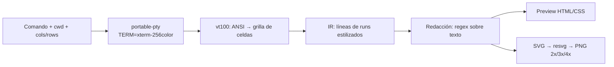

# termcard — Diseño

Capturador de salida de terminal con tarjeta visual exportable, similar a
[homeport/termshot](https://github.com/homeport/termshot) pero con interfaz
gráfica, redacción de datos sensibles y variantes de estilo.

Fecha: 2026-09-09 · Estado: aprobado por el usuario en chat

## Objetivo

Ejecutar un comando en una PTY dentro de la app, capturar su salida, redactar
datos sensibles (rutas, usuario, hostname) y exportar una tarjeta PNG en alta
calidad con estilo configurable.

## Stack

- **Tauri 2 + TypeScript** (frontend vanilla TS + Vite, sin framework).
- Rust: `portable-pty`, `vt100`, `resvg`, `serde`.
- Persistencia: `tauri-plugin-store`. Diálogos: `tauri-plugin-dialog`.
- Fuente: JetBrains Mono (SIL OFL) embebida, usada por preview y export.

## Arquitectura



Principio central: **un único IR compartido**. El preview web y el exportador
SVG son dos renderizadores independientes de la misma estructura; nunca se
rasteriza el DOM.

### IR

```rust
pub struct Run { text: String, fg: Option<Color>, bg: Option<Color>,
                 bold: bool, italic: bool, underline: bool }
pub struct Line { runs: Vec<Run> }
pub struct Capture { cols: u16, rows: u16, command_line: String, lines: Vec<Line> }
pub enum Color { Indexed(u8), Rgb(u8, u8, u8), Default, DefaultInverted }
```

Único payload cruzando el puente IPC (serde → JSON). `DefaultInverted` cubre
video inverso (selecciones, menús de fzf).

### Captura (backend)

`portable-pty` lanza `$SHELL -c <comando>` con cwd elegido, `TERM=xterm-256color`,
`COLORTERM=truecolor`. Búfer tope 5 MB. Botón Stop + kill automático a los
120 s. PTY se cierra tras la salida del proceso para capturar el flush final.

### Redacción

Lista de reglas `{ regex, replacement, enabled, is_default }` aplicada sobre
el texto de cada run y sobre la línea de comando mostrada. Tres reglas por
defecto (generadas una vez al primer arranque, editables y desactivables):
`/home/<usuario>` → `~`, nombre de usuario, hostname. Toggle temporal "mostrar
sin censura" solo afecta el preview; el export siempre usa texto redactado.
Regex: crate `regex`, sin soporte lookaround (limitación documentada).

### Prompt sintético

`$SHELL -c` no imprime prompt; la tarjeta antepone una línea `❯ <comando>`
con el símbolo configurable. El comando mostrado pasa por las mismas reglas
de redacción.

### Temas y variantes

Presets: Mac dark, Mac light, Minimal, Solarized. Parámetros: acento, fondo,
título de ventana, traffic lights, sombra, padding, radio, tamaño de fuente.
Todos valores planos interpretados por ambos renderizadores.

### UI

Una ventana, dos columnas. Izquierda: comando, cwd, cols/rows (100×30 por
defecto), reglas, botón Run (Ctrl+Enter). Derecha: tarjeta a tamaño real con
escala-ajuste, controles de tema, export (escala 2x/3x/4x, nombre, guardado
vía plugin dialog). UI en español, strings centralizados.

### Export

SVG generado en Rust (rects por fondo, texts por run, fuente embebida como
`@font-face` base64 en `<defs>`), rasterizado con `resvg` a escala 2/3/4.
Guardado con `tauri-plugin-dialog` + `std::fs`.

## Errores y límites

- Apps de pantalla completa (vim, htop): el estado final capturado puede no
  representar la experiencia interactiva. Fuera de alcance v1.
- Salida binaria: se degrada lossy (runs con bytes de control reemplazados).
- Lookbehind/lookahead en regex de redacción: no soportado por `regex`.
- Export falla con fuente no cargada → validación previa al rasterizado.

## Pruebas

- Rust: fixtures ANSI → IR (colores, negrita, truecolor), reglas de redacción
  (incluye comando), snapshot del SVG, dimensiones del PNG por escala.
- TS: mapeo tema → CSS vars.
- Smoke manual: flujo completo con `ls --color=auto`, `echo` con escape, `git status`.

## Entrega

`cargo tauri build` → `.deb` + AppImage (bundler de Tauri).