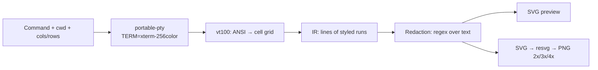

# termcard — Design

Terminal output capture tool with an exportable visual card, similar to
[homeport/termshot](https://github.com/homeport/termshot) but with a graphical
interface, redaction of sensitive data, and style variants.

Date: 2026-09-09 · Status: approved by the user in chat (original in Spanish, translated 2026-09-09)

## Goal

Run a command in a PTY inside the app, capture its output, redact sensitive
data (paths, username, hostname) and export a high-quality PNG card with
configurable style.

## Stack

- **Tauri 2 + TypeScript** (React 19 frontend + Vite; the spec originally said vanilla TS, the code settled on React).
- Rust: `portable-pty`, `vt100`, `resvg`, `serde`.
- Persistence: hand-rolled `once_store` JSON blob (the spec originally named `tauri-plugin-store`, since removed). Dialogs: `tauri-plugin-dialog`.
- Font: JetBrains Mono (SIL OFL) embedded, used by preview and export.

## Architecture



Core principle: **a single shared IR**. The web preview and the SVG exporter
are two independent renderers of the same structure; the DOM is never
rasterized. In practice the preview now renders the exporter's SVG directly,
so there is exactly one renderer.

### IR

```rust
pub struct Run { text: String, fg: Option<Color>, bg: Option<Color>,
                 bold: bool, italic: bool, underline: bool }
pub struct Line { runs: Vec<Run> }
pub struct Capture { cols: u16, rows: u16, command_line: String, lines: Vec<Line> }
pub enum Color { Indexed(u8), Rgb(u8, u8, u8), Default, DefaultInverted }
```

The only payload crossing the IPC bridge (serde → JSON). `DefaultInverted`
covers reverse video (selections, fzf menus).

### Capture (backend)

`portable-pty` launches `$SHELL -c <command>` with the chosen cwd,
`TERM=xterm-256color`, `COLORTERM=truecolor`. Buffer cap 5 MB. Stop button +
automatic kill at 120 s. The PTY closes after the process exits to capture the
final flush.

### Redaction

List of rules `{ regex, replacement, enabled, is_default }` applied over the
text of every run and over the displayed command line. Three default rules
(generated once on first run, editable and disableable):
`/home/<user>` → `~`, username, hostname. The temporary "show uncensored"
toggle only affects the preview; the export always uses redacted text.
Redaction happens at render time on the serialized JSON (not at capture time),
so editing rules updates the preview without re-capturing.
Regex: `regex` crate, no lookaround support (documented limitation).

### Synthetic prompt

`$SHELL -c` prints no prompt; the card prepends a `❯ <command>` line with a
configurable symbol. The displayed command goes through the same redaction
rules.

### Themes and variants

Presets: Mac dark, Mac light, Minimal, Solarized. Parameters: accent,
background, window title, traffic lights, shadow, padding, radius, font size.
All plain values interpreted by both renderers.

### UI

One window, two columns. Left: command, cwd, cols/rows (100×30 default),
rules, Run button (Ctrl+Enter). Right: card at real size with scale-to-fit,
theme controls, export (2x/3x/4x scale, name, saved via plugin dialog). UI in
Spanish and English, strings centralized in `src/i18n.ts` with the language
persisted in the store.

### Export

SVG generated in Rust (rects for backgrounds, texts per run, font embedded as
base64 `@font-face` in `<defs>`), rasterized with `resvg` at scale 2/3/4.
Saved with `tauri-plugin-dialog` + `std::fs`.

## Errors and limits

- Fullscreen apps (vim, htop): the captured final state may not represent the
  interactive experience. Out of scope for v1.
- Binary output: degraded lossy (runs with control bytes replaced).
- Lookbehind/lookahead in redaction regexes: not supported by `regex`.
- Export fails with a font not loaded → validation before rasterizing.

## Tests

- Rust: ANSI fixtures → IR (colors, bold, truecolor), redaction rules
  (command line included), SVG snapshot, PNG dimensions per scale.
- TS: theme → CSS vars mapping.
- Manual smoke: full flow with `ls --color=auto`, `echo` with escapes, `git status`.

## Delivery

`cargo tauri build` → `.deb` + AppImage (Tauri bundler).
